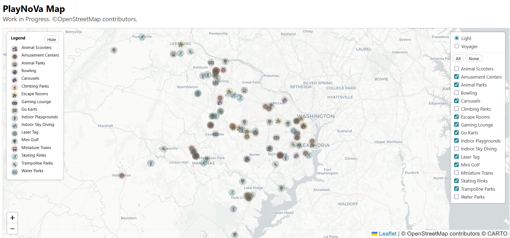

# Project: NoVa Fun Map
Mapping amusements, attractions, and family-friendly fun across Northern Virginia using OpenStreetMap data, Overpass API, and Leaflet. Many thanks to M. Wildon for sharing the <a href="https://github.com/watmildon/microcosm">microcosm<a/> template for fetching the data . 

<a href="https://j9code.github.io/nova-fun-map">NoVa Fun Map</a>

## Overview
This project demonstrates how to create and share an interactive map using OpenStreetMap data, with documented data sourcing, tagging decisions, and cartographic choices.  
It brings together:
- OpenStreetMap tagging
- Overpass API queries
- Layer configuration

## Data Sources
- **OpenStreetMap (OSM)** — community-maintained geographic data  
- **Overpass API** — used to extract amusement features by tag  

## Categories Mapped
The project currently focuses on:
- **Independents** (locally owned amusements)
- **Chains** (regional or national brands)
- **Specialty amusements** (e.g., animal scooters, miniature railways, carousels)

Each category has its own Overpass query and Leaflet layer.

## Administrative Boundaries
The project uses **OpenStreetMap administrative areas** to define the Northern Virginia region, rather than a custom bounding box. This ensures the map aligns with officially recognized county and city boundaries and avoids accidental inclusion of DC or Maryland nodes, ways, or relations.

The following OSM admin areas are used:

- **Arlington County**
- **Fairfax County**
- **Fauquier County**
- **Loudoun County**
- **Prince William County**

- **City of Alexandria**
- **City of Fairfax**
- **City of Falls Church**
- **City of Manassas**
- **City of Manassas Park**

These boundaries are referenced directly in the Overpass queries using their administrative levels.
See `docs/admin-areas.md` for details.

## How to Use This Repository
- In progress.

## Files
- `/data/` – OSM Overpass query results
- `/methods` – step-by-step documentation

## License
OSM‑derived data in this repository is © OpenStreetMap contributors and is available under the ODbL license.
All original content in this repository is released under the MIT License.
